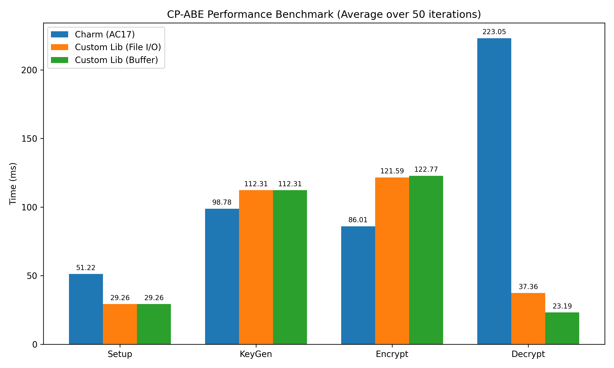
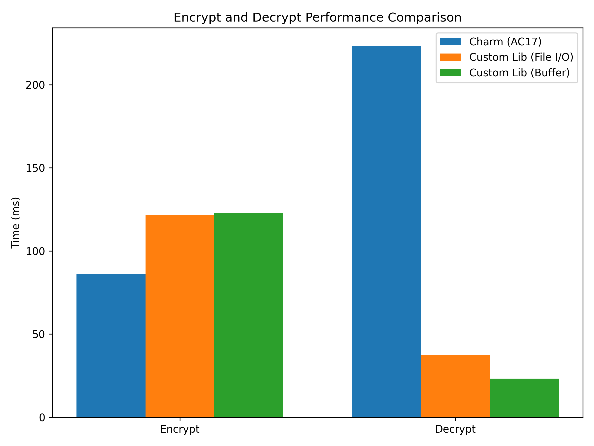

# Hybrid CP-ABE Library
Hybrid Ciphertext Policy Attribute Based Encryption Library for C/C++ in Windows/Linux

## Prerequisites

- [CryptoPP Library](https://github.com/weidai11/cryptopp)
- [CP-ABE AC17 Scheme](https://eprint.iacr.org/2017/807)
- [Rabe-ffi](https://github.com/Aya0wind/Rabe-ffi)

## Why Use This Library? (Performance & Benchmarks)

This library implements a highly optimized **KEM/DEM Hybrid Encryption architecture** combining the advanced access control of CP-ABE (using `rabe` & Rust) with the blazing-fast symmetric encryption of AES-GCM (using `CryptoPP` & C++). 

When benchmarked against the standard Python-based `charm-crypto` library using the AC17 scheme, this library demonstrates massive performance advantages, especially during decryption:

*   **Lightning-fast Decryption (O(1) Decryption Time):** Thanks to Rust's intelligent Minimum Satisfying Subset evaluation and optimized multi-pairing techniques, the decryption time is almost constant regardless of how complex the policy is. While `charm-crypto` scales linearly and takes >200ms for complex policies (12 attributes), this custom library completes decryption in a flat **~23ms**.
*   **Hardware-accelerated AES-GCM (AES-NI):** By using `CryptoPP` for the Data Encapsulation Mechanism (DEM) phase, the actual file data is encrypted and decrypted in less than 1 millisecond.
*   **Zero Python Interpreter Overhead:** Being a pre-compiled native library (C++/Rust FFI), it eliminates the heavy overhead of the Python interpreter and Python object conversions, making it ideal for integration into high-performance backends, embedded systems, or mobile applications.

### Benchmark Results (Complex Policy - 12 Attributes)
<p align="center">
  
  <br/>
  
</p>

> **Note:** The minor trade-off for this extreme decryption speed is a slightly slower encryption phase for very complex policies (due to the Rust `pest` parser generating the abstract syntax tree), but the massive decryption gains (nearly 10x faster) make it exceptionally well-suited for scalable real-world systems.

> **Disclaimer (Scope of Library):** This library is highly specialized and **only supports the AC17 CP-ABE scheme**. It is built specifically to achieve maximum performance and seamless C++ integration for this single algorithm. If your project requires a broader variety of cryptographic schemes (such as KP-ABE, IBE, signatures, etc.), we highly recommend using [Charm-crypto](https://github.com/JHUISI/charm), which offers a vast and flexible collection of cryptographic primitives.

## Building for Windows

1. Clone the repository:
    ```sh
    https://github.com/WanThinnn/Hybrid-CP-ABE-Library.git
    ```
2. Navigate to the project directory:
_Using x64 Native Tools Command Prompt for VS 2022_
   ```sh
    cd Hybrid-CP-ABE-Library/src/cpp
    code . #for open projects Visual Studio Code
    ```
4. Configure `tasks.json` to build the project using `cl.exe`:
    - Create or open the `.vscode` folder in your project directory.
    - Create a `tasks.json` file inside the `.vscode` folder with the following content in `./src/cpp/.vscode/tasks.json.windows`


5. Build the project:
    - Open Visual Studio Code and open your project.
    - Press `Ctrl+Shift+B` to run the configured build task.
    - If everything is configured correctly, your program will be compiled using `cl.exe`.


## Building for Linux (Ubuntu >= 22.04)
1. Clone the repository:
    ```sh
    https://github.com/WanThinnn/Hybrid-CP-ABE-Library.git
    ```
2. Navigate to the project directory:
    ```sh
    cd Hybrid-CP-ABE-Library/src/cpp
    code . #for open projects Visual Studio Code
    ```
3. Configure `tasks.json` to build the project using `g++`:
    - Create or open the `.vscode` folder in your project directory.
    - Create a `tasks.json` file inside the `.vscode` folder with the following content in `./src/cpp/.vscode/tasks.json.linux`
 
4. Build the project:
    - Open Visual Studio Code and open your project.
    - Press `Ctrl+Shift+B` to run the configured build task.
    - If everything is configured correctly, your program will be compiled using `g++`.
## Usage

### Using the Executable


The usage of the executable is as follows:
```sh
Usage: hybrid-cp-abe.exe [setup|genkey|encrypt|decrypt]
Usage: hybrid-cp-abe.exe setup <path_to_save_file>
Usage: hybrid-cp-abe.exe genkey <master_key_file> <attributes> <private_key_file>
Usage: hybrid-cp-abe.exe encrypt <public_key_file> <plaintext_file> <policy> <ciphertext_file>
Usage: hybrid-cp-abe.exe decrypt <private_key_file> <ciphertext_file> <recovertext_file>
```

Example commands:
```sh
hybrid-cp-abe.exe setup test_case
hybrid-cp-abe.exe genkey "test_case/cpabe_msk.key" "A B C" "test_case/cpabe_sk.key"
hybrid-cp-abe.exe encrypt "test_case/cpabe_pk.key" "test_case/plaintext.txt" "((A and C) or E)" "test_case/ciphertext.txt"
hybrid-cp-abe.exe decrypt "test_case/cpabe_sk.key" "test_case/ciphertext.txt" "test_case/recovertext.txt"
```
### Integrating the Library
After building the library, you can integrate it into any program on Windows/Linux. Here are the steps to include the library in your project.
Please go to <b>python-sources</b> folder to see more.

## Acknowledgements
Special thanks to [Aya0wind](https://github.com/Aya0wind) for the [Rabe-ffi](https://github.com/Aya0wind/Rabe-ffi) project and the [CryptoPP](https://github.com/weidai11/cryptopp) Library for helping me build this library.
## License

This project is open-source and available for anyone to use, modify, and distribute. We encourage you to clone, fork, and contribute to this project to help improve and expand its capabilities.
By contributing to this project, you agree that your contributions will be available under the same open terms.
